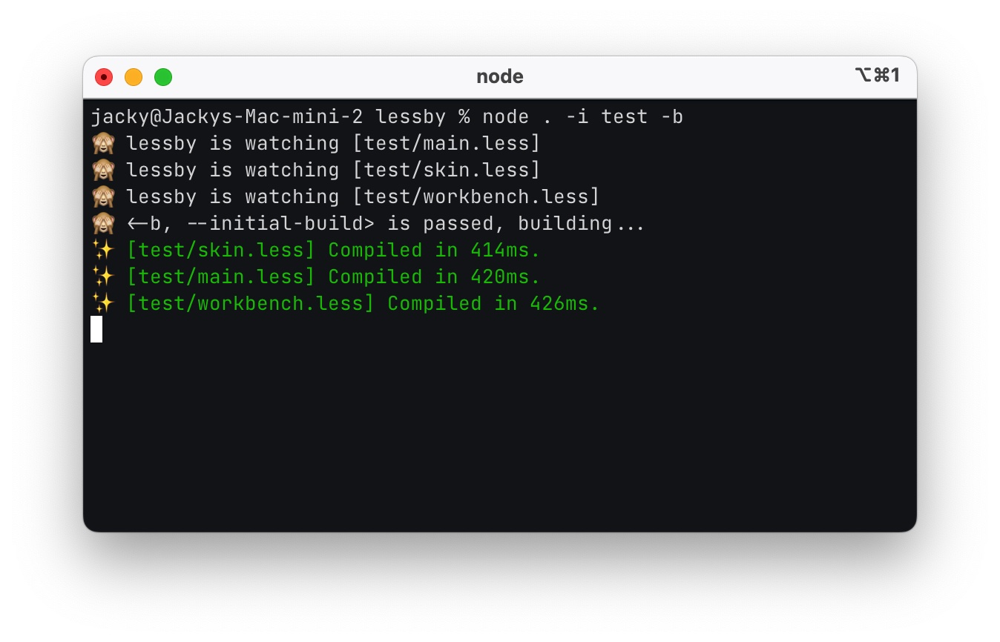

[](https://github.com/jw-12138/lessby/actions/workflows/node.js.yml)

[lessby](https://github.com/jw-12138/lessby/) is a simple CLI tool for compiling `.less` file.



## Installation

```
npm i lessby -D
```

## Usage

```text
Usage: lessby [options]

Options:
  -i, --input <folder>   input less folder
  -o, --output <folder>  output less folder
  -e, --extension <ext>  output file extension, eg. ' -e wxss '
  -b, --initial-build    compile less files before watch
  -r, --recursive        compile less files recursively
  -m, --minify           minify output file
  -s, --source-map       generate source map files
  --source-map-inline    generate inline source map files
  --one-time             compile less files ony once
  --mid-name <str>       specify output file middle name, eg. ' --mid-name min '
  --less-options <str>   specify original less-cli options, eg. ' --less-options "-l --no-color" '
  -h, --help             display help for command
```

### -i, --input <folder>

`required`

Normally, lessby will watch all the `.less` files inside the input folder, this action is **non-recursive**.

```bash
lessby -i <folder_name>
```

### -o, --output <folder>

lessby will output the `.css` files into the folder that you specified.

```bash
lessby -i <folder_name> -o <output_foler_name>
```

### -e, --extension <ext>

Seriously, it's not just CSS out there.

This will compile all the less files into CSS files with `.wxss` extension. You can use whatever extension you want.

```bash
lessby -i <folder_name> -e wxss
```

### -b, --initial-build

compile all the `.less` files once before watch

```bash
lessby -i <folder_name> -b
```

### -r, --recursive

FINALLY!!!

A less compiler with recursive option!

```bash
lessby -i src -r
```

If `src/` has a sub-folder, and it contains `.less` files, lessby will find it, and compile it.

### -m, --minify

As mentioned above, this parameter minifies output files.

```bash
lessby -i src -r -m
```

### -s, --source-map

lessby will generate source map files, those little things are helpful when in development.

```bash
lessby -i src -s
```

### --source-map-inline

lessby will generate inline source map, this will **overwrite** the `-s` option

```bash
lessby -i src -s
```

### --one-time

lessby will compile all the `.less` files only once, could be used in building stage.

```bash
lessby -i src --one-time
```

### --mid-name

Script below will compile all the `.less` files from `xxx.less` to `xxx.min.css`.

```bash
lessby -i <folder_name> -m --mid-name min
```

Since file extension names are customizable, I think I'll make the middle name part customizable too, you can compile
non-minified files with the name `min` in the middle, even if it is not recommended, but hey! Here we are!

### --less-options

And finally, the original `lessc` options.

Since this is a npm pack based on `lessc`, So I think it'll be good in case you need something I didn't cover.
