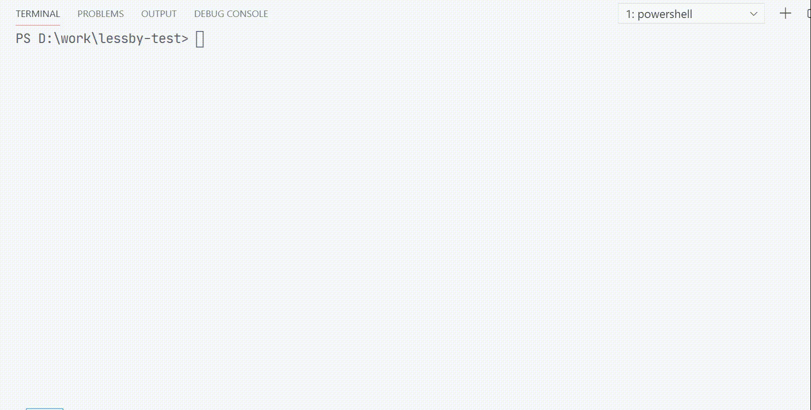

[](https://github.com/jw-12138/lessby/actions/workflows/node.js.yml)

[lessby](https://github.com/jw-12138/lessby/) is a simple less file cli-compiler.



## Installation

```
npm i lessby -D
```

### 1.1 update

First thing is, the imported less file changes can now trigger the parent less file to be compiled. Nested import is not supported yet. And still, there are a few things you need be aware of.

When use `@import`, the path name must contain at least one slash and the `.less` suffix is a must-have. You'll see why later.

```less
@import "./_comp.less";  // good

@import "_comp";  // bad
```

The current solution I use is like this:

1. find the imported files by analyzing the parent file line-by-line
2. get the line that has `@import`, and dump into path extraction module [extract-path](https://www.npmjs.com/package/extract-path)

The problem is, when i get the line like `@import "_comp.less";`, the extraction module kinda struggles, it doesn't know what the path is, instead of giving me `_comp.less` it gives me the unchanged string, which will lead to lessby can't load the imported files correctly. 

If you have any better ideas, any kinda help will be appreciated!

Secondly, the file name started with `_` like `_comp.less` will be ignored by lessby now, these kinda file will be marked as import file, so no direct compilation.

## Usage

```text
Usage: lessby [options]

Options:
  -i, --input <folder>   input less folder
  -o, --output <folder>  output less folder
  -e, --extension <ext>  output file extension, eg. ' -e wxss '
  --mid-name <str>       specify output file middle name, eg. ' --mid-name min '
  -r, --recursive        compile less files recursively
  -m, --minify           minify output file
  -s, --source-map       generate source map files
  --less-options <str>   specify original less-cli options, eg. ' --less-options "-l --no-color" '
  -h, --help             display help for command
```

### `-i, --input <folder>`

`required`  
```shell
lessby -i <folder_name>
```

Normally, lessby will watch all the less files inside the input folder, this action is **non-recursive**.

### `-o, --output <folder>`

```shell
lessby -i <folder_name> -o <output_foler_name>
```

### `-e, --extension <ext>`

Seriously, it's not just CSS out there.

```shell
lessby -i <folder_name> -e wxss
```

This will compile all the less files into CSS files with `.wxss` extension. You can use whatever extension you want.

### `--mid-name <str>`

```shell
lessby -i <folder_name> -m --mid-name min
```

Script above will compile all the less files from `xxx.less` to `xxx.min.css`.

Since file extension names are customizable, I think I'll make the middle name part customizable too, you can compile non-minified files with the name `min` in the middle, even if it is not recommended, but hey! Here we are!

### `-r, --recursive`

FINALLY!!!  

A less compiler with recursive option!

```shell
lessby -i src -r
```

If `src/` has a sub-folder and it contains less files, lessby will find it, and kill it... i mean, compile it. seen the movie `TAKEN`? no? ok. nvm🌝

### `-m, --minify`

As mentioned above, this parameter minifies output files.

```shell
lessby -i src -r -m
```

### `-s, --source-map`

lessby will generate source map files, those little things are helpful when in development.

```shell
lessby -i src -s
```

### `--less-options <str>`

And finally, the original `lessc` options.  

Since this is an npm pack based on `lessc`, So I think it'll be good in case you need something I didn't cover.
